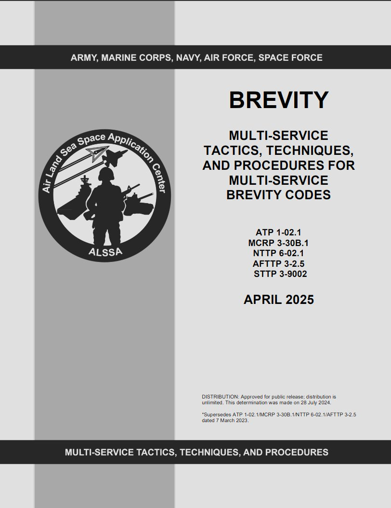
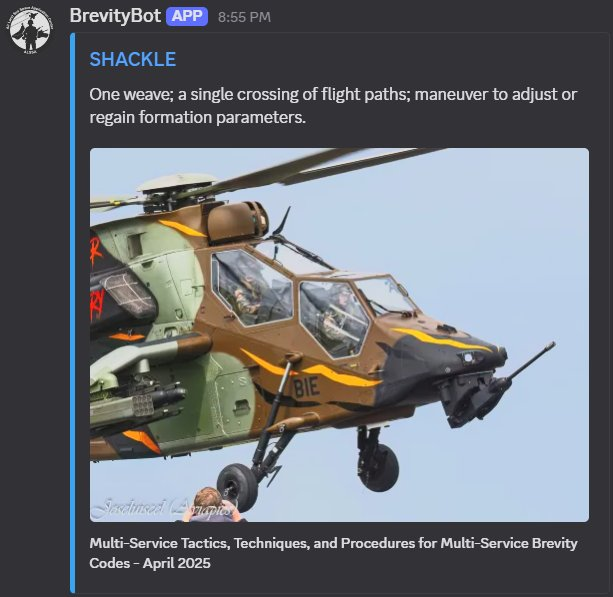

# BrevityBot

A Discord bot that helps flight sim squadrons and individual pilots learn the tactical brevity codes used in military aviation — short, standardized radio terms like SHACKLE, BOGEY, and FOX TWO. Built for steady practice, BrevityBot reinforces the codes through scheduled daily terms, on-demand lookups, and quizzes so they become second nature on the radio.

The terms are sourced from the publicly available multi-service brevity standard *Multi-Service Tactics, Techniques, and Procedures for Multi-Service Brevity Codes* (ATP 1-02.1 / MCRP 3-30B.1 / NTTP 6-02.1 / AFTTP 3-2.5 / STTP 3-9002) maintained by the [Air Land Sea Space Application (ALSSA) Center](https://www.alssa.mil/).

  

## What it does

BrevityBot drops a brevity term into your channel on whatever schedule you set, cycling through the full list without repeats. You can also pull up any definition instantly with `/define`, and test yourself (or compete with the server) using the built-in quizzes.

  

## Features

- **Scheduled posts** — A new term is posted automatically at an interval you choose (default: every 24 hours), rotating through all terms before repeating.
- **On-demand lookup** — `/define` searches and explains any term, with autocomplete, without consuming it from the rotation.
- **Manual posting** — Grab the next term whenever you want with `/nextterm`.
- **Quizzes** — Multiple-choice questions generated from the term definitions, in a public timed poll or a private solo run.
- **Greenie board** — Tracks each user's last 10 quiz scores, naval-aviation style.
- **Per-server config** — Every server has its own channel, schedule, rotation state, and scores.

## Quick start

Invite the bot to your server:

**[➕ Add BrevityBot to Discord](https://discord.com/oauth2/authorize?client_id=1359029668547924098)**

Then run `/setup` in the channel where you want terms posted.

## Commands

| Command | Description |
|---------|-------------|
| `/setup` | Configure the current channel for automatic posting |
| `/nextterm` | Manually post the next brevity term |
| `/define <term>` | Look up a term's definition (with autocomplete) |
| `/quiz [questions] [mode] [duration]` | Start a quiz (1–10 questions, public or private) |
| `/quizstop` | Cancel the current public quiz |
| `/quizpurge` | Force-clear a stuck active-quiz lock  |
| `/greenieboard` | View the quiz leaderboard (last 10 results per user) |
| `/setfrequency <hours>` | Set the posting interval |
| `/enableposting` | Resume automatic posting |
| `/disableposting` | Pause automatic posting |
| `/reloadterms` | Refresh the term list |
| `/checkperms` | Verify the bot's permissions in the current channel |

## How it works

Terms and definitions are sourced from [Wikipedia's Multi-service tactical brevity code](https://en.wikipedia.org/wiki/Multi-service_tactical_brevity_code) page (which mirrors the ALSSA publication) and cached in Redis. Each server tracks its own rotation, schedule, and quiz scores independently. Background tasks handle scheduled posting, periodic term refreshes, and health logging. Quizzes are built by masking the term out of its own definition and adding distractor answers.

## Contributing

Contributions are welcome — feel free to open a pull request.

## Support

Common issues:

- **Bot not responding** — Confirm the bot has the right permissions (`/checkperms`).
- **Terms not posting** — Make sure posting is enabled (`/enableposting`).
- **A public quiz needs to be cancelled** — A mod can run `/quizstop` (Manage Messages) to end it immediately and skip the summary. If a new quiz refuses to start because of a stuck lock, an admin can run `/quizpurge` (Manage Server) to clear it.

For bugs or feature requests, [open an issue](https://github.com/joemurrell/brevitybot/issues).
